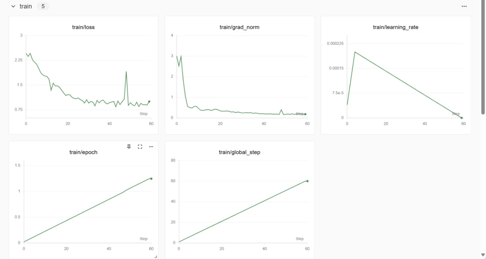
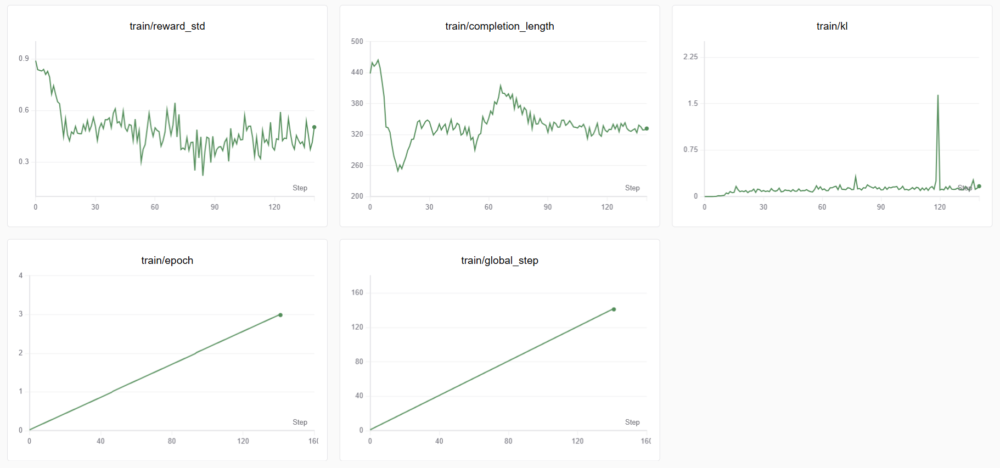

## 模型地址
[Modelscope 模型地址：deep-cot-eval-rag](https://www.modelscope.cn/collections/deep-cot-eval-rag-9bbc5f02a7854e)
## 1. 动机

### **1.1 传统RAG评估的局限性**

现有评估指标在复杂生成场景下存在显著缺陷，难以全面量化RAG系统的真实性能：

| **评估指标** | **核心缺陷** | **典型案例分析** |
| --- | --- | --- |
| **答案忠实性** | 无法检测生成答案中的**事实性幻觉** | ▶ 提问："爱因斯坦相对论内容"▶ 生成答案："包含狭义/广义相对论（正确）+ 提出量子力学（虚构）"▶ 传统指标评分：高（仅验证引用完整性） |
| **答案相关性** | 依赖字面匹配导致**信息密度误判** | ▶ 优质答案："健康饮食需包含水果、蔬菜等5类食物"▶ 低质答案："健康饮食很重要"▶ 传统指标评分：两者相关性等同 |

### **1.2** 我们的方法

**LLM as Judge**：利用思维链一步步推导得出answer的最终正确性，但成本昂贵，通过小模型对齐大模型的推理逻辑，实现低成本高精度的评估能力迁移。

## 2. 如何评测效果

**数据集来源：**[FlashRAG数据集 · 数据集](https://www.modelscope.cn/datasets/hhjinjiajie/FlashRAG_Dataset)中的wiki_qa其中有answer的数据`（861条样本，训练/验证=761/100）`

**构建数据集：**

1. query输入豆包-1.5-lite-32k，得到一个answer-hat
2. answer和answer_hat输入deepseek-r1，评估answer-hat答案正确性，得到一个思维链think和评估结果output
3. 得到模型输入：answer和answer_hat，推理过程：think，结果：output。

|  | 主要答案正确性 | 次要答案正确性 | 格式正确性 |
| --- | --- | --- | --- |
| **Qwen2.5-1.5B-Instruct** | 64 | 76 | 100 |
| **SFT-Lora-cot** | 63 | 69 | 95 |
| **RL-GRPO-16** | 75 | 76 | 100 |
| **RL-GRPO-32** | 75 | 78 | 100 |
- RL-GRPO系列模型较基线提升**11%**，强化学习在关键事实验证上的显著优势。
- SFT-LoRA-CoT表现略低于基线（-1%），单纯监督学习模型能力有上限。

## 3. 问题方法

### 3.1 问题

小模型推理能力不足，可解释性差

### 3.2 解决方法

- 🚀 **思维链（Chain-of-Thought）增强评估**:通过小模型生成可解释的评分推理过程
- 🔄 **两阶段训练框架**：
  1. **监督微调（SFT）**：学习基础推理格式
  2. **强化学习（RL）**：提升复杂场景泛化能力

### 3.3 原因——>为什么要用强化学习

- **监督学习缺点**：模型只能被动模仿标注的推理路径，缺乏自主探索能力。对于复杂问题（如多步推理、模糊边界的评分），模型可能仅学会"表面格式"，但无法真正优化推理质量。
- **RL的优势**：通过设计**细粒度奖励函数**（如评分格式正确性、关键事实匹配度），RL允许模型在自由生成过程中动态调整策略，逐步逼近最优推理路径，而非机械复制标注数据。
- **RL的泛化机制**:通过让模型在生成过程中探索多种可能的推理路径（如尝试不同的事实对比策略）。

## 4. SFT

### 4.1 数据构造

输入：answer，answer_hat让模型评估

输出：<[think]>—<[think]> + <[output]>—<[output]>

### 4.2 训练参数

```python
r = 16
lora_alpha = 16,#LoRA 的缩放因子 LoRA 的更新量为 低秩矩阵 A * 低秩矩阵 B * (alpha / r)。
lora_dropout = 0,
per_device_train_batch_size = 2,# 每个设备（如 GPU）上的训练批次大小。
gradient_accumulation_steps = 4,# 多次累积梯度再更新参数，模拟更大的批次大小。
warmup_steps = 5,# 在训练初期逐步将学习率从 0 增加到设定值，避免初始阶段参数更新过大。
max_steps = 60,# 最大训练步数。
learning_rate = 2e-4,
fp16 = not is_bfloat16_supported()#是否启用 FP16 混合精度训练。
weight_decay = 0.01
```

### 4.3 训练结果

- 损失值从初始的约2.25快速下降至0.75左右（60步内），整体下降趋势明显。
- 为了防止过拟合，在训练60step在模型有思维链之后就停掉了SFT



## 5. GRPO

### 5.1 数据和奖励函数

- 数据使用：输入：answer，answer_hat让模型评估，只使用output给模型奖励(结果正确)
- 奖励函数：格式奖励和结果正确的奖励（基于规则）

### 5.2 训练参数

```python
    use_vllm = True, # use vLLM for fast inference
    vllm_gpu_memory_utilization = 0.9,
    learning_rate = 3e-5,
    adam_beta1 = 0.9,#控制 Adam 优化器的一阶（动量）和二阶（自适应学习率）估计衰减率。
    adam_beta2 = 0.999,
    weight_decay = 0.1,
    warmup_ratio = 0.1,#预热步数
    beta=0.01,#kl散度的系数，越小模型更自由
    per_device_train_batch_size = 16,#单 GPU 每次处理的样本数
    gradient_accumulation_steps = 8, # Increase to 4 for smoother training
    num_generations = 16, # 每轮评估生成的文本数量，影响验证阶段内存占用
    max_prompt_length = max_seq_length,
    max_completion_length = max_seq_length//2,
    num_train_epochs = 3,
    max_grad_norm = 0.5,#梯度裁剪阈值，防止梯度爆炸。
    torch_compile=True#启用 PyTorch 2.0 的图编译优化
```

### 5.3 训练过程

1. num_generations =**16**


2. num_generations =32




## 6. 后续工作
本次使用的数据集质量较低且数量烧，且wiki百科的数据大部分模型应该都见过，无法评估在复杂场景下的能力
- 使用更大质量更高的数据集
- SFT是否可以进行的更长
- 奖励函数优化
